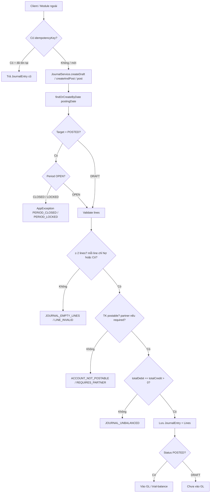

# Frezo Backend — module-accounting-bom (Kế toán)

> Module sổ cái double-entry của Frezo ERP: hệ thống tài khoản (COA), kỳ tài chính, chứng từ journal, sổ cái (GL), đối chiếu ngân hàng; BCTC/VAT còn stub.
> Đọc **cùng** [DATABASE_STANDARD.md](../DATABASE_STANDARD.md), [README-SEED.md](../module-accounting-bom/README-SEED.md). Cross-module CRM / Payroll / Khấu hao / Warehouse — mục 5 và 12.

Package gốc: `com.frezo.accounting`. Module Maven: `module-accounting-bom`.  
Base API: `/accounting/*`. Dependencies: `module-common`, `module-auth-bom`.

**Cửa vào GL duy nhất:** `JournalService` — mọi module ngoài chỉ được gọi `createAndPost()` / `reverse()`. Không insert thẳng bảng `acc_journal_*`.

---

## 1. Big picture — kế toán Frezo làm gì trong ERP?

Trong ERP, mỗi nghiệp vụ (bán hàng, trả lương, khấu hao…) có sổ riêng (subledger). Kế toán là **chỗ gom số tiền vào một ngôn ngữ chung** để:

| Việc | Ý nghĩa thực tế |
|------|-----------------|
| **COA** (hệ thống tài khoản) | “Từ điển” số hiệu TK — 111 tiền mặt, 131 phải thu, 511 doanh thu… |
| **Kỳ tài chính** (`FiscalPeriod`) | Cửa sổ thời gian (tháng) — mở thì ghi sổ được, đóng thì chặn |
| **Journal** (chứng từ / bút toán) | Một lần ghi sổ: nhiều dòng Nợ + Có, tổng Nợ luôn = tổng Có |
| **GL** (sổ cái) | Tổng hợp mọi chứng từ **đã POSTED** theo từng TK — xem số dư, trial balance |

**Vì sao cần double-entry?** Mỗi giao dịch ảnh hưởng ít nhất 2 chỗ (ví dụ: bán chịu → tăng phải thu **và** tăng doanh thu). Nợ = Có giúp số không “mất cân”.

**Chuẩn kế toán VN trong code:**

| Chuẩn | Enum | Đối tượng |
|-------|------|-----------|
| **TT133** | `AccountingStandard.TT133` | DN SME — seed mặc định |
| **TT99** | `AccountingStandard.TT99` | DN mọi lĩnh vực (thay TT200) |

**Không nhầm:** xác nhận phiếu lương trên Mobile (`PayslipConfirmation`) **không** ghi sổ. Hạch toán lương là API khác (`post-to-gl`).

---

## 2. Thuật ngữ ngắn (đọc trước khi vào code)

| Thuật ngữ | Nghĩa trong Frezo |
|-----------|-------------------|
| **COA** | Chart of Accounts — danh sách TK (`acc_account`). Seed từ `CoaTT133` / `CoaTT99`. |
| **Journal / chứng từ** | `JournalEntry` + các `JournalEntryLine`. Một chứng từ = một lần ghi sổ. |
| **Draft** | `JournalStatus.DRAFT` — nháp, chưa vào GL. |
| **Posted** | `JournalStatus.POSTED` — đã ghi sổ; GL chỉ tính dòng này. |
| **Reverse / đảo** | Tạo chứng từ mới (swap Nợ↔Có), gốc → `REVERSED`. Không xóa số cũ. |
| **GL** | General Ledger — sổ cái theo TK (`GLService`). |
| **Trial balance** | Bảng cân đối phát sinh — tổng Nợ/Có theo từng TK trong khoảng ngày. |
| **Fiscal period** | Kỳ tháng (`FiscalPeriod`). Status: `OPEN` / `CLOSED` / `LOCKED`. |
| **PostingSource** | Nguồn chứng từ (`MANUAL`, `PAYROLL`, `SALES_INVOICE`…) — để audit ngược subledger. |
| **Idempotency key** | Khóa chống double-post (`payroll:2026-03`, `invoice:{id}`…). Trùng key → trả entry cũ. |
| **postable** | TK lá mới ghi được. TK cha (`postable=false`) → lỗi `ACCOUNT_NOT_POSTABLE`. |

---

## 3. Luồng end-to-end bằng lời (story cho junior)

Hình dung công ty mới bật module kế toán:

### Bước A — Setup một lần

1. Chọn chuẩn **TT133** hoặc **TT99** (`PUT /accounting/setting`, có thể `seedCoa: true`).
2. Hệ thống tạo / cập nhật `AccountingSetting` (mapping TK lương mặc định).
3. Seed COA → hàng chục TK sẵn (không cần gõ tay từng số hiệu).
4. `POST /accounting/periods/ensure?year=2026` → năm tài chính + **12 kỳ OPEN**.

*Không có kỳ OPEN thì không post được.* Khi post, `findOrCreateByDate` có thể tự `ensureYear` nếu thiếu — nhưng onboarding rõ ràng vẫn nên gọi ensure trước.

### Bước B — Tạo bút toán (manual hoặc từ module khác)

- **Manual:** kế toán tạo DRAFT (`POST /journals/draft`) hoặc post luôn (`POST /journals/post`).
- **Tự động:** CRM / QLNS / DMDC gọi `JournalService.createAndPost(...)` với `PostingSource` + `idempotencyKey`.

Mỗi dòng: **chỉ Nợ hoặc chỉ Có** (không cả hai, không cả hai = 0). Tổng Nợ phải = tổng Có và > 0.

### Bước C — Post vào sổ

- DRAFT → `POST /journals/{id}/post` → status `POSTED`, gắn `postedAt`.
- Hoặc create-and-post một lần.
- Kỳ của `postingDate` phải `OPEN` (không `CLOSED` / `LOCKED`).

### Bước D — Xem số

- Sổ cái 1 TK: `GET /accounting/gl/ledger?accountCode=&from=&to=`
- Cân đối phát sinh: `GET /accounting/gl/trial-balance?from=&to=`
- Chỉ dòng thuộc chứng từ **POSTED** mới vào GL.

### Bước E — Sai thì đảo, không sửa

- `POST /journals/{id}/reverse?reason=...`
- Tạo entry mới `sourceType=REVERSAL` (swap Nợ/Có), gốc → `REVERSED`.
- Ngày post đảo = **hôm nay** (kỳ hiện tại phải OPEN).

### Tóm tắt một dòng

```
Setup (setting + COA + kỳ)
  → Journal DRAFT / createAndPost
  → POSTED (vào GL)
  → Xem ledger / trial-balance
  → (nếu cần) reverse → REVERSED + entry đảo mới
```

---

## 4. Flowchart — post journal



ASCII (khi Mermaid không render):

```
[Request] → idempotency? → trả cũ
         ↓ mới
[findOrCreate period] → nếu POSTED: period phải OPEN
         ↓
[validate: ≥2 lines | 1 phía Nợ/Có | postable | partner | Nợ=Có]
         ↓
[save JournalEntry + Lines]
         ↓
POSTED → GL query thấy  |  DRAFT → GL bỏ qua
```

**Reverse:**

```
POSTED original ──reverse──► entry mới POSTED (REVERSAL, swap Nợ/Có)
                             original.status = REVERSED
```

---

## 5. Ai gọi vào accounting? (`PostingSource`)

Accounting **không tự biết** lương hay hóa đơn. Module nghiệp vụ dựng dòng bút toán rồi gọi `JournalService`.

| PostingSource | Ai gọi | Trigger / API | Idempotency (ví dụ) | Trạng thái |
|---------------|--------|---------------|---------------------|------------|
| `MANUAL` | FE kế toán / seed | `POST /accounting/journals/*` | tùy client | ✅ |
| `PAYROLL` | `PayrollGLPostingServiceImpl` (QLNS) | `POST /qlns/payslip/period/{y}/{m}/post-to-gl` | `payroll:YYYY-MM` | ✅ |
| `REVERSAL` | `JournalServiceImpl.reverse` (+ QLNS `reverse-gl`) | `POST .../journals/{id}/reverse` | — | ✅ |
| `SALES_INVOICE` | `InvoiceServiceImpl.postToGL` (CRM) | `POST /crm/invoices/{id}/post-to-gl` | `invoice:{id}` | ✅ |
| `CASH_BANK` | `InvoiceServiceImpl` thu tiền | khi ghi nhận payment HĐ | `invoice-payment:{id}:{ts}` | ✅ |
| `DEPRECIATION` | `DepreciationServiceImpl` (DMDC/QTBV) | post khấu hao kỳ | `DEP-YYYY-MM` | ✅ |
| `PURCHASE` | Warehouse GRN (dự kiến) | — | — | ❌ enum sẵn, **chưa impl** |
| `INVENTORY` | Giá vốn 632 (dự kiến) | — | — | ❌ enum sẵn, **chưa impl** |

**Warehouse hôm nay:** GRN/GIN chỉ cập nhật tồn kho. Có `GrnConfirmedEvent` nhưng **không** listener kế toán — chưa gọi `JournalService`.

**Payslip confirm (Mobile):** `POST /qlns/payslip/{payrollId}/confirm` → `PayslipConfirmationService` → bảng `acc_payslip_confirmation`. **Không** tạo journal.

### Bút toán mẫu (để đọc code nhanh)

| Nguồn | Mẫu Nợ / Có |
|-------|-------------|
| Payroll | Nợ `6421` (gross) · Có `334` + `3383/3384/3385` + `3335` + `3382` (mapping từ `AccountingSetting`) |
| HĐ bán | Nợ `131` · Có `5113` (+ `33311` nếu có thuế) |
| Thu tiền HĐ | Nợ `1121`/`111` · Có `131` |
| Khấu hao | Nợ `642` · Có `214` |

---

## 6. Trạng thái chứng từ & rule bắt buộc

### 6.1 `JournalStatus`

| Status | Vào GL? | Được làm gì tiếp? |
|--------|---------|-------------------|
| `DRAFT` | ❌ | Post → `POSTED` |
| `POSTED` | ✅ | Chỉ **reverse** (không sửa/xóa) |
| `REVERSED` | ❌ (gốc đã vô hiệu) | Không post lại; số đã cân bằng nhờ entry đảo |

### 6.2 `PeriodStatus`

| Status | Post journal | Close / reopen API |
|--------|--------------|--------------------|
| `OPEN` | ✅ | Có thể close |
| `CLOSED` | ❌ `PERIOD_CLOSED` | Có thể reopen |
| `LOCKED` | ❌ `PERIOD_LOCKED` | ❌ close/reopen cũng chặn |

⚠️ **WIP:** enum có `LOCKED` nhưng **chưa có API** set LOCKED / quyết toán năm. `FiscalYear.closed` có trên model — chưa API riêng.

### 6.3 Rule vàng

| ✅ | ❌ |
|----|----|
| Mọi post ngoài module qua `JournalService` + `idempotencyKey` | Insert thẳng `acc_journal_entry` bỏ validate |
| Period `OPEN` mới ghi sổ | Post vào kỳ `CLOSED` / `LOCKED` |
| Sai số → `reverse` | Sửa / xóa chứng từ đã `POSTED` |
| Ghi lên TK `postable=true`; TK `requiresPartner` có `partnerId` | Ghi lên TK cha / thiếu đối tượng |
| Phân biệt confirm payslip vs payroll GL | Coi “NV đã xem phiếu lương” = đã hạch toán |

---

## 7. Class map

### 7.1 Controllers (8 trong module; payslip confirm ở QLNS)

| Controller | Path prefix | Vai trò |
|------------|-------------|---------|
| `AccountingSettingController` | `/accounting/setting` | Cấu hình chuẩn + mapping TK |
| `AccountController` | `/accounting/accounts` | COA CRUD + seed |
| `FiscalPeriodController` | `/accounting/periods` | Năm / kỳ, close / reopen |
| `JournalController` | `/accounting/journals` | Draft / post / reverse |
| `GLController` | `/accounting/gl` | Ledger + trial balance |
| `BankStatementController` | `/accounting/bank-statements` | Import / match / lock |
| `FinancialReportController` | `/accounting/reports` | BCTC **stub** |
| `VatReportController` | `/accounting/tax` | VAT **stub** |

### 7.2 Services

| Interface | Impl | Vai trò |
|-----------|------|---------|
| `AccountingSettingService` | `AccountingSettingServiceImpl` | Singleton settings, đổi chuẩn, seed COA |
| `AccountService` | `AccountServiceImpl` | COA CRUD + `seedChartOfAccounts` |
| `FiscalPeriodService` | `FiscalPeriodServiceImpl` | ensureYear, close/reopen, findOrCreateByDate |
| `JournalService` | `JournalServiceImpl` | **Cửa GL** — draft / post / reverse, validate Nợ=Có |
| `GLService` | `GLServiceImpl` | Ledger + trial balance (chỉ POSTED) |
| `BankStatementService` | `BankStatementServiceImpl` | Import CSV, match/unmatch, lock |
| `FinancialReportService` | `FinancialReportServiceImpl` | BS + IS — **stub**, không full VAS |
| `VatReportService` | `VatReportServiceImpl` | VAT thô TK 133*/3331* — **stub** |
| `PayslipConfirmationService` | `PayslipConfirmationServiceImpl` | Confirm payslip Mobile (không GL) |

### 7.3 Bank / seed / enums

| Class | Vai trò |
|-------|---------|
| `BankCsvParser` | Parse CSV `GENERIC_CSV` (header EN/VI) |
| `BankMatchEngine` | Exact + fuzzy (amount 50 + date 30 + desc 20) |
| `CoaTT133` / `CoaTT99` | Seed ~73 / ~82 TK rút gọn |
| `CoaSeedItem` | Metadata seed |
| `AccountingDataInitializer` | Profile `local` \| `seed`, `@Order(90)`, idempotent |
| `JournalStatus`, `PeriodStatus`, `PostingSource`, `AccountType`, `AccountingStandard` | Enum nghiệp vụ |
| `AccountingErrorCode` | Mã lỗi domain |

### 7.4 Package layout

```
com.frezo.accounting/
├── common/          # Enums + AccountingErrorCode
├── config/AccountingDataInitializer.java
├── controller/
├── dto/request|response/
├── entity/          # 9 bảng acc_*
├── repository/
├── service/ + impl/
├── bank/BankCsvParser.java, BankMatchEngine.java
└── seed/CoaTT133.java, CoaTT99.java, CoaSeedItem.java
```

---

## 8. API map

> `@CheckPermission` trên mọi endpoint. Prefix gateway `/accounting/...`. Permission seed: `module-auth-bom` `permission_data.sql`.

### 8.1 Setup & COA

| Method | Path | Mục đích |
|--------|------|----------|
| GET | `/accounting/setting` | Lấy cấu hình (auto-create default TT133 nếu chưa có) |
| PUT | `/accounting/setting` | Cập nhật chuẩn, mapping TK lương; optional `seedCoa: true` |
| GET | `/accounting/accounts` | List; query `?standard=TT133\|TT99` |
| GET | `/accounting/accounts/{id}` | Chi tiết |
| POST / PUT / DELETE | `/accounting/accounts`, `/{id}` | CRUD (delete = soft) |
| POST | `/accounting/accounts/seed?standard=` | Seed COA idempotent → `{ created: N }` |

### 8.2 Kỳ tài chính

| Method | Path | Mục đích |
|--------|------|----------|
| GET | `/accounting/periods?year=` | 12 kỳ (default năm hiện tại) |
| POST | `/accounting/periods/ensure?year=` | Tạo FiscalYear + 12 kỳ OPEN (idempotent) |
| POST | `/accounting/periods/{id}/close` | OPEN → CLOSED |
| POST | `/accounting/periods/{id}/reopen` | CLOSED → OPEN |

### 8.3 Journal & GL

| Method | Path | Mục đích |
|--------|------|----------|
| GET | `/accounting/journals/{id}` | Chi tiết + lines |
| GET | `/accounting/journals` | Filter: `periodId` **hoặc** `source`+`sourceId`; **không param → `[]`** |
| POST | `/accounting/journals/draft` | Tạo DRAFT |
| POST | `/accounting/journals/post` | Tạo + POST (idempotent `idempotencyKey`) |
| POST | `/accounting/journals/{id}/post` | Post DRAFT có sẵn |
| POST | `/accounting/journals/{id}/reverse?reason=` | Đảo POSTED → entry REVERSAL mới |
| GET | `/accounting/gl/ledger` | `accountCode`, `from`, `to` |
| GET | `/accounting/gl/trial-balance` | `from`, `to` |

### 8.4 Bank / reports / tax

| Method | Path | Mục đích |
|--------|------|----------|
| GET | `/accounting/bank-statements` | List statements |
| POST | `/accounting/bank-statements/import` | multipart: `accountId` + CSV |
| GET | `/accounting/bank-statements/{id}/lines` | `?status=all\|matched\|unmatched` |
| GET | `/accounting/bank-statements/{id}/suggestions/{lineId}` | `?mode=exact\|fuzzy` |
| POST | `/accounting/bank-statements/lines/{lineId}/match` | Body `{ journalEntryLineId }` |
| POST | `/accounting/bank-statements/lines/{lineId}/unmatch` | Bỏ match |
| POST | `/accounting/bank-statements/{id}/lock` | LOCKED |
| POST | `/accounting/bank-statements/{id}/reopen` | OPEN lại |
| GET | `/accounting/reports/balance-sheet` | `from`, `to` — **stub** |
| GET | `/accounting/reports/income-statement` | `from`, `to` — **stub** |
| GET | `/accounting/tax/vat` | `year`, `month` — **stub** |

### 8.5 API tích hợp (module khác)

| Module | Endpoint | PostingSource |
|--------|----------|---------------|
| CRM | `POST /crm/invoices/{id}/post-to-gl` | `SALES_INVOICE` |
| CRM | Thu tiền HĐ (service nội bộ) | `CASH_BANK` |
| QLNS | `POST /qlns/payslip/period/{year}/{month}/post-to-gl` | `PAYROLL` |
| QLNS | `POST .../reverse-gl` | → `JournalService.reverse` |
| QLNS | `POST /qlns/payslip/{payrollId}/confirm` | → `acc_payslip_confirmation` (**không GL**) |
| DMDC | Post khấu hao kỳ | `DEPRECIATION` |

---

## 9. Setup — Setting / COA / Fiscal

### 9.1 Onboarding lần đầu

```
1. PUT /accounting/setting  { "standard": "TT133", "seedCoa": true }
   → getOrCreateDefault() + optional seed CoaTT133 / CoaTT99

2. POST /accounting/periods/ensure?year=2026
   → FiscalYear (01/01–31/12) + 12 FiscalPeriod status=OPEN

Hoặc profile local|seed: AccountingDataInitializer — xem README-SEED.md
```

### 9.2 Mapping TK lương mặc định (TT133)

| Field | Default |
|-------|---------|
| `accSalaryExpense` | 6421 |
| `accSalaryPayable` | 334 |
| `accBhxhPayable` | 3383 |
| `accBhytPayable` | 3384 |
| `accBhtnPayable` | 3385 |
| `accPitPayable` | 3335 |
| `accUnionFee` | 3382 |
| `payrollPostingStrategy` | `AGGREGATE_PERIOD` |

Đổi sang **TT99:** auto map `6421→642`, `3385→3386` (nếu user chưa override).

### 9.3 Account rules

| Rule | |
|------|--|
| ✅ `postable=false` → không ghi journal (TK cha) | |
| ✅ `requiresPartner=true` → bắt buộc `partnerId` trên line (131, 331, 334…) | |
| ✅ Delete = soft-delete + `active=false` | |
| ❌ Không xóa vật lý COA đang dùng | |

---

## 10. Journal — chi tiết validate (`JournalServiceImpl.persist`)

| # | Rule |
|---|------|
| 1 | ≥ 2 lines |
| 2 | Mỗi line: **chỉ Nợ HOẶC Có** |
| 3 | TK tồn tại, `postable=true`; `requiresPartner` → có partner |
| 4 | `totalDebit == totalCredit` và > 0 |
| 5 | Khi POSTED: period phải `OPEN` |
| 6 | `idempotencyKey` unique → trả entry cũ nếu trùng |

**Mã chứng từ:** `JV-YYYY-MM-{8-char UUID}` (không sequential).

**Reverse:** chỉ từ `POSTED`; entry mới `sourceType=REVERSAL`, posting date = hôm nay; original → `REVERSED`.

---

## 11. GL — sổ cái & trial balance

| Thành phần | Cách tính (`GLServiceImpl`) |
|------------|------------------------------|
| Opening | sum(debit−credit) đến `from−1` + `Account.openingBalance` |
| Lines | Chỉ chứng từ `POSTED` trong `[from, to]` (JPQL filter status) |
| Running balance | Theo bản chất TK (debit nature: ASSET / EXPENSE) |
| Trial balance | Aggregate theo account: opening / period / closing Dr–Cr |

---

## 12. Bank statements — import & match

```
Import CSV (TK 112*)
  → BankCsvParser.parse()
  → acc_bank_statement (OPEN) + lines (UNMATCHED)
  → BankMatchEngine.tryAutoMatch() — đúng 1 candidate → MATCHED

Manual: suggestions (exact|fuzzy) → POST match
Lock statement → chặn match / unmatch
```

| Mode | Tiêu chí |
|------|----------|
| Exact | Cùng `accountId`, `postingDate`, amount |
| Fuzzy | Score amount50 + date30 + desc20; top 20 |

**Rule:** ✅ Lock khi chốt đối chiếu tháng · ❌ Match/unmatch khi LOCKED · ⚠️ Match **không** check fiscal period OPEN.

---

## 13. Báo cáo & thuế — gọi rõ là stub

| Report | Logic hiện tại | Giới hạn |
|--------|----------------|----------|
| Balance sheet | Group trial balance theo `AccountType` | Comment code: *"Stub BCTC TT133 — không phải full VAS"* |
| Income statement | REVENUE / EXPENSE từ period Dr–Cr; `netIncome = rev − exp` | Chưa form chuẩn BCTC |
| VAT | Sum debit `133*` / credit `3331*`–`33311*` | *"Stub — chưa đủ form tờ khai GTGT"* |

**Đừng** trình bày với BA/QA như đã hoàn thiện tờ khai / BCTC chính thức.

---

## 14. Bảng DB (`acc_*`)

> Schema: Hibernate `ddl-auto` (local update / prod validate). **Chưa** có Flyway `acc_*` trong `module-server`. Audit: `BaseEntity`.

| Bảng | Entity | Cột nghiệp vụ chính |
|------|--------|---------------------|
| `acc_setting` | `AccountingSetting` | standard, currency, payroll strategy, mapping TK lương |
| `acc_account` | `Account` | code UK, type, standard, postable, requires_partner, opening_balance |
| `acc_fiscal_year` | `FiscalYear` | code UK, start/end, closed |
| `acc_fiscal_period` | `FiscalPeriod` | month+year UK, status, closed_at/by |
| `acc_journal_entry` | `JournalEntry` | code, posting_date, period, source, idempotency_key, status, reversal_of_id |
| `acc_journal_entry_line` | `JournalEntryLine` | line_no, account, debit/credit, partner/dept/project |
| `acc_bank_statement` | `BankStatement` | account, file, matched counts, status |
| `acc_bank_statement_line` | `BankStatementLine` | txn, amount, match_status, matched_journal_line_id |
| `acc_payslip_confirmation` | `PayslipConfirmation` | payroll_id UK, person, confirmed_at, IP/device |

| Hạng mục | Chi tiết |
|----------|----------|
| Account delete | Soft + `active=false` |
| Journal | Không API xóa; chỉ reverse |
| `@Version` | **Chưa** có trên entity accounting |
| Idempotency | `JournalEntry.idempotencyKey` chống double-post |

---

## 15. Cross-links

| Module | Class / artifact | Liên hệ |
|--------|------------------|---------|
| `module-crm-bom` | `InvoiceServiceImpl` | Post doanh thu / thu tiền |
| `module-qlns-bom` | `PayrollGLPostingServiceImpl`, `PayslipController` | Lương GL + confirm payslip |
| `module-dmdc-bom` (QTB V / TSCĐ) | `DepreciationServiceImpl` | Khấu hao |
| `module-warehouse-bom` | GRN/GIN, `GrnConfirmedEvent` | Tồn kho — **chưa** bridge GL |
| `module-auth-bom` | `permission_data.sql` | Permission `/accounting/*` |
| `module-common` | `BaseEntity`, `AppException`, `CheckPermission` | Dùng chung |

Guild liên quan: [module-warehouse-bom.md](./module-warehouse-bom.md) · [DATABASE_STANDARD.md](../DATABASE_STANDARD.md) · [README-SEED.md](../module-accounting-bom/README-SEED.md).

---

## 16. Error codes — `AccountingErrorCode`

| Key | HTTP | Khi nào gặp |
|-----|------|-------------|
| `accounting.account.not_found` | 404 | Sai số hiệu TK |
| `accounting.account.code_exists` | 409 | Trùng code khi tạo |
| `accounting.account.not_postable` | 400 | Ghi lên TK cha (vd. `511` thay vì `5113`) |
| `accounting.account.requires_partner` | 400 | Thiếu partner trên 131/334… |
| `accounting.period.not_found` | 404 | Kỳ không tồn tại |
| `accounting.period.closed` | 409 | Post khi kỳ CLOSED |
| `accounting.period.already_closed` | 409 | Close lại kỳ đã đóng |
| `accounting.period.locked` | 409 | LOCKED — chặn post / close / reopen |
| `accounting.journal.not_found` | 404 | Sai id chứng từ |
| `accounting.journal.unbalanced` | 400 | Nợ ≠ Có |
| `accounting.journal.empty_lines` | 400 | < 2 dòng |
| `accounting.journal.line_invalid` | 400 | Một dòng vừa Nợ vừa Có / cả hai 0 |
| `accounting.journal.already_posted` | 409 | Post lại DRAFT đã POSTED |
| `accounting.journal.already_reversed` | 409 | Reverse khi không còn POSTED |
| `accounting.fiscal_year.not_found` / `.exists` | 404 / 409 | Năm TC |
| `accounting.setting.not_initialized` | 412 | Chưa cấu hình (ít gặp vì getOrCreateDefault) |
| `accounting.payroll.already_posted` | 409 | (mã domain; idempotency thường trả entry cũ) |
| `accounting.payroll.not_approved` | 400 | BL chưa duyệt |

---

## 17. Seed (`AccountingDataInitializer`)

| Điều kiện | Profile `local` hoặc `seed` — **không** chạy `prod` |
|-----------|-----------------------------------------------------|

| Loại | Chi tiết |
|------|----------|
| Settings | TT133, VND, mapping TK lương |
| COA | `CoaTT133` — skip code đã có |
| Fiscal | Năm hiện tại + 12 kỳ OPEN |
| Journal POSTED | `SEED-ACC-OPENING`, `SEED-ACC-BANK-DEPOSIT`, `SEED-ACC-REVENUE` |
| Journal DRAFT | `SEED-ACC-EXPENSE-DRAFT` |
| Bank | `seed-bank-statement.csv` trên TK 1121 |

Chi tiết: [README-SEED.md](../module-accounting-bom/README-SEED.md).

---

## 18. WIP / roadmap (đừng hiểu nhầm là Done)

| Hạng mục | Trạng thái thật |
|----------|-----------------|
| BCTC full VAS / form chuẩn | **Stub** |
| Tờ khai GTGT đầy đủ | **Stub** |
| API set `PeriodStatus.LOCKED` / quyết toán năm | **Chưa** |
| Warehouse GRN/GIN → `PURCHASE` / `INVENTORY` | Enum sẵn, **chưa impl** |
| Flyway migration `acc_*` | **Chưa** (ddl-auto) |
| Optimistic lock journal (`@Version`) | **Chưa** |
| GL filter soft-deleted lines | Gap tiềm ẩn |

---

## 19. Checklist — dev mới đọc trong 15 phút

### 19.1 Hiểu luồng (5 phút)

- [ ] Big picture: COA + kỳ + journal + GL; cửa vào = `JournalService`
- [ ] Story: setup → draft/post → xem GL → reverse
- [ ] Glossary: DRAFT / POSTED / REVERSED; OPEN / CLOSED; PostingSource; idempotency
- [ ] Ai post: CRM invoice, Payroll, Depreciation ✅; Warehouse ❌; payslip confirm ≠ GL

### 19.2 Đọc code lõi (7 phút)

- [ ] `JournalServiceImpl.persist` + `reverse` + `assertPeriodStatus`
- [ ] `FiscalPeriodServiceImpl.ensureYear` / close / reopen
- [ ] `GLServiceImpl` + repo filter `status = POSTED`
- [ ] Một call site ngoài: `InvoiceServiceImpl.postToGL` **hoặc** `PayrollGLPostingServiceImpl`
- [ ] Stub: `FinancialReportServiceImpl`, `VatReportServiceImpl` — đọc comment đầu class

### 19.3 Smoke verify (3 phút)

- [ ] GET `/accounting/setting` + COA đã seed
- [ ] `POST /periods/ensure?year=` → 12 kỳ OPEN
- [ ] Post journal cân Nợ/Có → thấy trên ledger / trial-balance
- [ ] (Optional) CRM hoặc Payroll `post-to-gl` — chạy lại không double-post

### 19.4 Rule nhớ khi code

| ✅ | ❌ |
|----|----|
| `createAndPost` + `idempotencyKey` | Bypass `JournalService` |
| Period OPEN | Post kỳ đóng |
| Reverse khi sai | Update dòng POSTED |
| TK lá postable | Ghi `511` thay vì `5113` |
| Stub = stub | Ship BCTC/VAT như production-ready |

---

*Cập nhật khi đổi chuẩn COA, rule post journal, bridge warehouse GL, hoặc nâng BCTC/VAT khỏi stub.*
